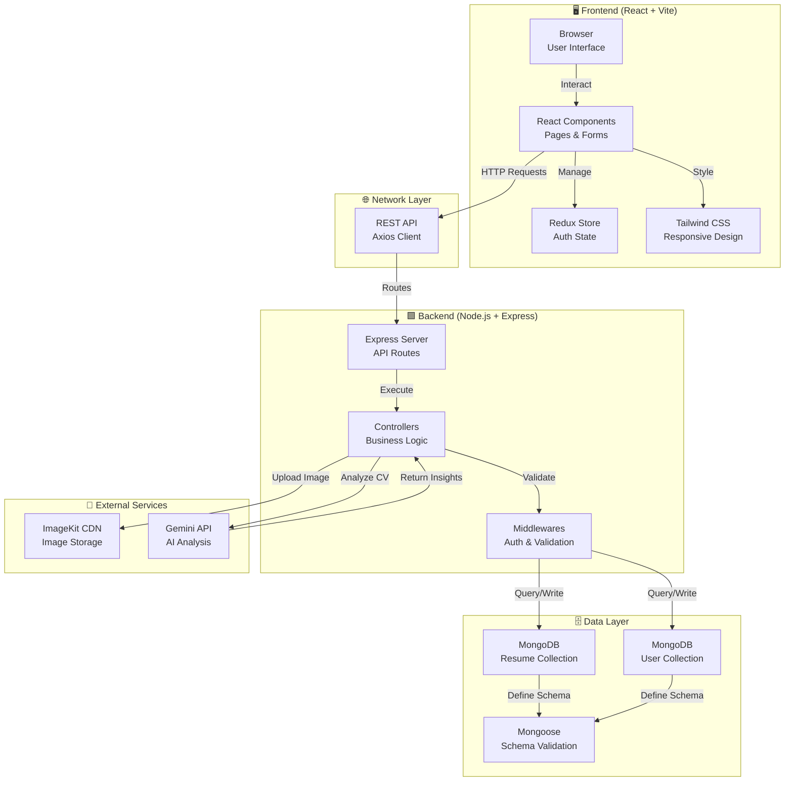
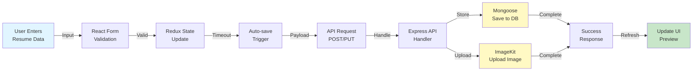
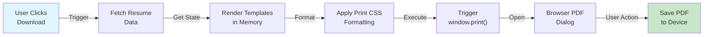

# 📋 Resume Builder - Project Report

**Author:** Hermann N'zi Ngenda  
**Frontend:** [https://resume-builder-bdm.pages.dev/](https://resume-builder-bdm.pages.dev/)  
**Backend:** [https://resume-builder-40jg.onrender.com](https://resume-builder-40jg.onrender.com)  
**Project Date:** 2026

---

## 📑 Table of Contents
- [Project Overview](#-project-overview)
- [Features](#-features)
- [Technology Stack](#-technology-stack)
- [Project Architecture](#-project-architecture)
- [Data Flow](#-data-flow)
- [Project Structure](#-project-structure)
- [Getting Started](#-getting-started)
- [Deployment](#-deployment)

---

## 🎯 Project Overview

**Resume Builder** is a full-stack web application that enables users to create, customize, and download professional resumes with multiple design templates. The application provides an intuitive interface for entering personal information, work experience, education, skills, and projects, with real-time preview functionality and multiple resume templates.

### Key Capabilities
- ✅ User authentication and account management
- ✅ Multiple resume templates (Classic, Modern, Minimal, MinimalImage)
- ✅ Real-time resume preview
- ✅ Technology stack visualization with 25+ tech icons
- ✅ PDF download and print functionality
- ✅ Cloud image storage integration
- ✅ AI-powered resume analysis and optimization
- ✅ Responsive design for all devices

---

## ✨ Features

### For Users
- **Interactive Resume Editor**: Form-based interface with organized sections
- **Multiple Templates**: Choose from 4 professionally designed resume layouts
- **Technology Icons**: Visual representation of technical skills with 25+ language/framework icons
- **Contact Integration**: GitHub profile and portfolio website links
- **Real-time Preview**: See changes instantly as you edit
- **Download & Print**: Generate PDF or print directly from browser
- **Auto-save**: Automatic saving of resume data to prevent loss
- **Image Upload**: Profile picture upload with cloud storage

### For Developers
- **RESTful API**: Clean API endpoints for all resume operations
- **AI Integration**: Powered by Gemini API for intelligent analysis
- **Modular Architecture**: Separated client and server for scalability
- **Secure Authentication**: MongoDB-based user management
- **Image Optimization**: ImageKit integration for fast image delivery

---

## 🛠️ Technology Stack

### Frontend
```
⚛️  React.js 19.2.0         - UI Framework
```
- **Web Framework**: React with Vite 7.2.4 (ultra-fast build tool)
- **Routing**: React Router 7.12.0 for multi-page navigation
- **State Management**: Redux Toolkit 2.11.2 for global auth state
- **Styling**: Tailwind CSS 4.1.18 + custom CSS
- **Icons**: Font Awesome 6.x via react-icons + Lucide React icons
- **HTTP Client**: Axios for API communication
- **Build Tool**: Vite with optimized production bundle (~809KB, gzipped 253KB)

### Backend
```
🟩 Node.js 18+              - JavaScript Runtime
```
- **API Framework**: Express.js for RESTful endpoints
- **Database**: MongoDB with Mongoose ODM for schema validation
- **Authentication**: JWT (JSON Web Tokens) for secure sessions
- **File Upload**: Multer middleware for form-data handling
- **AI Services**: Google Gemini API for resume analysis
- **Image Storage**: ImageKit CDN for efficient image delivery
- **Environment Management**: dotenv for configuration

### DevOps & Deployment
```
🌐 Cloudflare Pages         - Frontend Hosting (client/)
📦 Render                   - Backend Hosting (server/)
🗄️  MongoDB Atlas            - Cloud Database
```

---

## 🏗️ Project Architecture



---

## 📊 Data Flow

### Resume Creation & Update Flow



### Resume Download & Print Flow



---

## 📁 Project Structure

```
resume-builder/
│
├── client/                        # Frontend (React + Vite)
│   ├── src/
│   │   ├── App.jsx               # Main app component
│   │   ├── main.jsx              # React DOM render entry
│   │   ├── App.css               # Global styles
│   │   ├── index.css             # Base styles
│   │   ├── app/                  # Redux store
│   │   │   ├── store.js          # Redux configuration
│   │   │   └── features/
│   │   │       └── authSlice.js  # Auth state management
│   │   ├── assets/               # Static assets & templates
│   │   │   ├── assets.js         # Asset exports
│   │   │   └── templates/        # 4 resume templates
│   │   │       ├── ClassicTemplate.jsx
│   │   │       ├── ModernTemplate.jsx
│   │   │       ├── MinimalTemplate.jsx
│   │   │       └── MinimalImageTemplate.jsx
│   │   ├── components/           # React components
│   │   │   ├── ColorPicker.jsx      # Theme color selector
│   │   │   ├── EducationForm.jsx    # Education section
│   │   │   ├── ExperienceForm.jsx   # Work experience section
│   │   │   ├── PersonalInfoForm.jsx # Contact & personal details
│   │   │   ├── ProjectForm.jsx      # Projects with tech icons
│   │   │   ├── SkillsForm.jsx       # Skills with tech selection
│   │   │   ├── ProfessionalSummaryForm.jsx
│   │   │   ├── TemplateSelector.jsx # Template switcher
│   │   │   ├── resumePreview.jsx    # Preview & print wrapper
│   │   │   ├── Loader.jsx           # Loading state
│   │   │   ├── Navbar.jsx           # Navigation header
│   │   │   ├── home/                # Landing page sections
│   │   │   │   ├── Banner.jsx
│   │   │   │   ├── Hero.jsx
│   │   │   │   ├── Features.jsx
│   │   │   │   ├── CallToAction.jsx
│   │   │   │   ├── Testimonial.jsx
│   │   │   │   ├── Footer.jsx
│   │   │   │   └── Title.jsx
│   │   │   └── projectTechCatalog.jsx # Tech icons library
│   │   ├── configs/
│   │   │   └── api.js            # Axios instance
│   │   └── pages/                # Page components
│   │       ├── Home.jsx          # Landing page
│   │       ├── Layout.jsx        # Route layout wrapper
│   │       ├── Login.jsx         # Authentication page
│   │       ├── Dashboard.jsx     # User dashboard
│   │       ├── ResumeBuilder.jsx # Main editor page
│   │       └── Preview.jsx       # Preview-only page
│   ├── index.html                # HTML entry point
│   ├── vite.config.js            # Vite configuration
│   ├── eslint.config.js          # Linting rules
│   ├── package.json              # Dependencies & scripts
│   └── .env                      # Frontend environment variables
│
└── server/                        # Backend (Node.js + Express)
    ├── server.js                 # Express app entry point
    ├── package.json              # Dependencies & scripts
    ├── configs/
    │   ├── db.js                 # MongoDB connection
    │   ├── ai.js                 # Gemini API initialization
    │   ├── imageKit.js           # ImageKit CDN setup
    │   └── multer.js             # File upload configuration
    ├── controllers/
    │   ├── userController.js     # User signup/login/profile
    │   ├── resumeController.js   # Resume CRUD operations
    │   └── aiController.js       # AI analysis endpoints
    ├── models/
    │   ├── User.js               # User schema & authentication
    │   └── Resume.js             # Resume schema with tech/links
    ├── middlewares/
    │   └── authMiddleware.js     # JWT verification
    ├── routes/
    │   ├── userRoutes.js         # User endpoints
    │   ├── resumeRouter.js       # Resume endpoints
    │   └── aiRoutes.js           # AI endpoints
    ├── scripts/
    │   ├── mongo-diagnose.mjs    # Database troubleshooting
    │   ├── ai-diagnose.mjs       # AI service diagnostics
    │   ├── ai-summary-test.mjs   # Summary generation test
    │   └── summary-controller-test.mjs
    └── .env                      # Server environment variables
```

---

## 🚀 Getting Started

### Prerequisites
- Node.js 18+ 
- npm or yarn package manager
- MongoDB Atlas account
- Gemini API key
- ImageKit account

### Installation

**1. Clone the repository**
```bash
git clone <repository-url>
cd resume-builder
```

**2. Setup Frontend**
```bash
cd client
npm install
npm run dev        # Development server at http://localhost:5173
```

**3. Setup Backend**
```bash
cd server
npm install
npm run dev        # Express server at http://localhost:5000
```

### Environment Configuration

**client/.env**
```
VITE_BASE_URL=http://localhost:5000
```

**server/.env**
```
PORT=5000
MONGODB_URI=mongodb+srv://<username>:<password>@cluster.mongodb.net/resume-builder
JWT_SECRET=your-jwt-secret-key
GEMINI_API_KEY=your-gemini-api-key
IMAGEKIT_PUBLIC_KEY=your-imagekit-public-key
IMAGEKIT_PRIVATE_KEY=your-imagekit-private-key
IMAGEKIT_URL_ENDPOINT=your-imagekit-url-endpoint
NODE_ENV=development
```

### Available Scripts

**Frontend:**
```bash
npm run dev         # Start development server
npm run build       # Build for production
npm run preview     # Preview production build
npm run lint        # Run ESLint
```

**Backend:**
```bash
npm run dev         # Start with nodemon
npm start           # Start server
npm run mongo-diagnose    # Check MongoDB connection
npm run ai-diagnose      # Check Gemini API
```

---

## 🌐 Deployment

### Frontend Deployment (Cloudflare Pages)

1. **Push code to GitHub**
   ```bash
   git push origin main
   ```

2. **Connect to Cloudflare Pages**
   - Visit [https://pages.cloudflare.com](https://pages.cloudflare.com)
   - Import your GitHub repository
   - Set **Root Directory** to `client`
   - Set **Framework preset** to `React (Vite)`
   - Set **Build command** to `npm run build`
   - Set **Build output directory** to `dist`
   - Add environment variable: `VITE_BASE_URL` = `https://resume-builder-40jg.onrender.com`

3. **Deploy**
   - Click "Save and Deploy"
   - Your app will be live within minutes

### Backend Deployment (Render/Railway)

1. **Select Hosting Platform**
   - Option A: [Render.com](https://render.com)
   - Option B: [Railway.app](https://railway.app)

2. **Create New Service**
   - Connect GitHub repository
   - Set root directory to `server`
   - Select Node.js environment
   - Add all environment variables from `.env`

3. **Configure**
   - Update `VITE_BASE_URL` in frontend `.env` with your backend URL
   - Redeploy frontend with new backend URL

### Database Deployment (MongoDB Atlas)

1. Create cluster at [mongodb.com/atlas](https://www.mongodb.com/atlas)
2. Create database user with appropriate permissions
3. Get connection string and add to server `.env`
4. Database indexes are auto-created by Mongoose schema

---

## 📊 Technology Highlight

### Frontend Technologies
- **React 19.2.0**: Modern component-based UI framework
- **Vite 7.2.4**: Lightning-fast build tool with HMR support
- **Tailwind CSS 4.1.18**: Utility-first CSS framework for rapid styling
- **Redux Toolkit**: Efficient state management with less boilerplate
- **React Router 7.12.0**: Client-side routing for SPA navigation
- **Axios**: Promise-based HTTP client for API calls

### Backend Technologies
- **Express.js**: Fast and minimalist web framework
- **MongoDB**: NoSQL database for flexible schema
- **Mongoose**: ODM for schema validation and relationships
- **JWT**: Secure token-based authentication
- **Google Gemini API**: Advanced AI for resume analysis
- **ImageKit**: CDN for optimized image delivery

### Supported Technologies (25+)
| Category | Technologies |
|----------|--------------|
| **Languages** | JavaScript, TypeScript, Python, Java, C++, C#, Go |
| **Frontend** | React, Vue, Angular, Next.js, Svelte |
| **Backend** | Node.js, Python, Java, PHP, Ruby |
| **Tools** | Git, Docker, Kubernetes, VS Code, AWS |
| **Databases** | MongoDB, PostgreSQL, MySQL |

---

## 📈 Performance Metrics

- **Frontend Bundle Size**: 809 KB (gzipped: 253 KB)
- **Build Time**: < 2 seconds (Vite HMR)
- **Production Build**: Optimized with tree-shaking & minification
- **Database Queries**: Indexed for fast retrieval
- **Image Delivery**: CDN-optimized via ImageKit

---

## 🔐 Security Features

- ✅ JWT-based authentication with expiration
- ✅ Password hashing (bcrypt recommended)
- ✅ CORS enabled for cross-origin requests
- ✅ Input validation on both client and server
- ✅ MongoDB injection prevention via Mongoose
- ✅ Secure image upload handling
- ✅ Environment variable protection
- ✅ HTTPS required for production

---

## 🎨 Resume Templates

### 1. **Classic Template**
Professional and traditional layout with clear section hierarchy.

### 2. **Modern Template**
Contemporary design with color accents and sidebar information.

### 3. **Minimal Template**
Clean and simple design focusing on content readability.

### 4. **Minimal Image Template**
Minimal design with integrated profile image layout.

All templates support:
- Technology icons with 25+ tech options
- GitHub and portfolio links
- Custom color theming
- Print-optimized layout

---

## 🤝 Features in Action

### Resume Sections
1. **Personal Information**: Name, contact, GitHub, portfolio website
2. **Professional Summary**: Brief overview of professional background
3. **Work Experience**: Job history with descriptions and dates
4. **Education**: Academic qualifications and certifications
5. **Skills**: Technical expertise with visual tech icons
6. **Projects**: Portfolio projects with technologies used
7. **Tech Usage**: Visual representation of technology stack

### Interactive Features
- Real-time preview as you edit
- Drag-and-drop reordering (planned)
- Color theme customization
- Download as PDF
- Print functionality
- Auto-save to database

---

## 📞 Contact & Support

**Project Author:** Hermann N'zi Ngenda

For issues, feature requests, or contributions, please submit via:
- GitHub Issues
- Email: [www.ngendahermann14@gmail.com]

---

## 🙏 Acknowledgments

- Built with modern web technologies and best practices
- Inspired by professional resume builders
  
**Status:** ✅ Active & Deployed  
**Live:** [https://resume-builder-bdm.pages.dev/](https://resume-builder-bdm.pages.dev/)  
**Backend:** [https://resume-builder-40jg.onrender.com](https://resume-builder-40jg.onrender.com)

